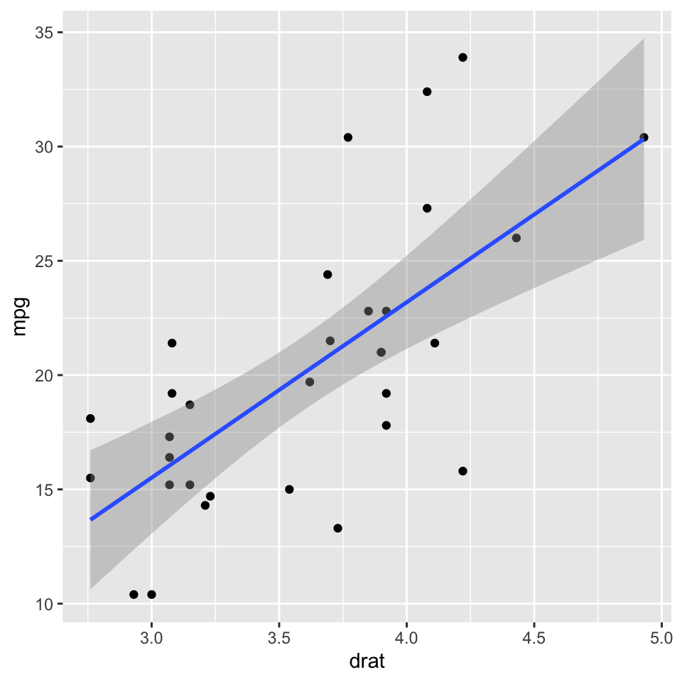

### Hello 👋

-   🔭 I’m currently working on projects related to coronal stop
    production in bilinguals.
-   👯 I’m looking to collaborate on all kinds of stuff. Get in touch
    with me!
-   📫 How to reach me:
    <a href="mailto:joseph.casillas@rutgers.edu" class="email">joseph.casillas@rutgers.edu</a>

<!-- -->

    library("tidyverse")

    ## ── Attaching packages ──────────────── tidyverse 1.3.0.9000 ──

    ## ✓ ggplot2 3.3.1     ✓ purrr   0.3.4
    ## ✓ tibble  3.0.1     ✓ dplyr   1.0.0
    ## ✓ tidyr   1.1.0     ✓ stringr 1.4.0
    ## ✓ readr   1.3.1     ✓ forcats 0.5.0

    ## ── Conflicts ──────────────────────── tidyverse_conflicts() ──
    ## x dplyr::filter() masks stats::filter()
    ## x dplyr::lag()    masks stats::lag()

    mtcars %>% 
      ggplot(., aes(x = drat, y = mpg)) + 
        geom_point() + 
        geom_smooth(method = lm)

    ## `geom_smooth()` using formula 'y ~ x'

